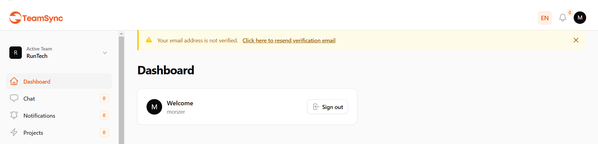
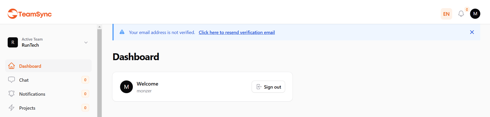
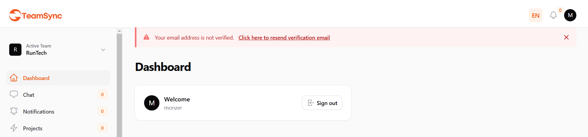

# Filament Email Verification Alert

A Filament plugin that adds an email verification alert to your admin panel. This plugin integrates seamlessly with Filament's design and provides an easy way to alert users about email verification.

## Features
- 🔔 Email verification alert for unverified users
- 🎨 Multiple color themes (yellow, blue, red)
- 🌐 RTL support
- ⚡ Lazy loading support
- 💪 Customizable verification handling
- 🔒 Session-based alert persistence
- ✖️ Optional close button
- 🔄 Configurable loading placeholder


## Screenshots





## Installation

You can install the package via composer:

```bash
composer require monzer/filament-email-verification-alert
```

## Basic Usage

In your `FilamentServiceProvider` or any service provider where you configure your panel, add:

```php
use Monzer\FilamentEmailVerificationAlert\EmailVerificationAlertPlugin;

public function panel(Panel $panel): Panel
{
    return $panel
        ->plugins([
            EmailVerificationAlertPlugin::make(),
        ]);
}
```

## Available Methods

### Basic Configuration

```php
EmailVerificationAlertPlugin::make()
```
Creates a new instance of the plugin.

### Color Customization

```php
->color('blue') // 'yellow', 'blue', or 'red'
```
Sets the color theme for the alert. Defaults to 'yellow'.

### Alert Persistence

```php
->persistClosedState() // Alert will stay hidden after being closed until the session ends
```

By default, the alert will reappear if the page is refreshed after closing. Using `persistClosedState()` makes the closed state persist throughout the user's session.

### Alert Visibility Controls

#### Closable Button

```php
->closable(false) // Removes the close button, making the alert persistent
```

By default, the alert shows a close button. You can disable it to make the alert persistent.

#### Placeholder Loading State

```php
->placeholder(false) // Disables the loading placeholder
```

Control the visibility of the loading placeholder during lazy loading.

### Verification Handler

```php
->verifyUsing(function($user) {
    // Custom verification logic
    $user->notify(new CustomVerificationNotification());
    
     Notification::make()
     ->title(trans('filament-email-verification-alert::messages.verification.success'))
     ->success()
     ->send();
})
```
Customizes how verification emails are sent.

### Position Customization

By default the `panels::topbar.start` hook is used to render the alert. But you can use any of the [Render Hooks](https://filamentphp.com/docs/3.x/support/render-hooks) available in Filament using the `renderHook()` method as:

```php
->renderHookName('panels::body.start')
```

### Scoping

```php
->renderHookScopes([ListUsers::class])
```
Limits where the alert appears. By default, shows on all pages.

### Lazy Loading

```php
->lazy(false) // Default is true
```
Controls whether the alert is lazy loaded.

### Complete Example

```php
use Monzer\FilamentEmailVerificationAlert\EmailVerificationAlertPlugin;

public function panel(Panel $panel): Panel
{
    return $panel
        ->plugins([
            EmailVerificationAlertPlugin::make()
                ->color('blue')
                ->persistClosedState()
                ->closable(true)
                ->placeholder(true)
                ->renderHookName('panels::body.start')
                ->renderHookScopes(['list', 'form'])
                ->lazy(false)
                ->verifyUsing(function($user) {
                 // Custom verification logic
                  $user->notify(new CustomVerificationNotification());
    
                  Notification::make()
                  ->title(trans('filament-email-verification-alert::messages.verification.success'))
                  ->success()
                  ->send();
                }),
        ]);
}
```

### Method Chaining

All methods return the plugin instance, allowing for method chaining:

```php
EmailVerificationAlertPlugin::make()
    ->color('blue')
    ->persistClosedState()
    ->closable(true)
    ->placeholder(true)
    ->lazy(false)
    ->renderHookName('panels::body.start');
```

## License

The MIT License (MIT). Please see [License File](LICENSE.md) for more information.